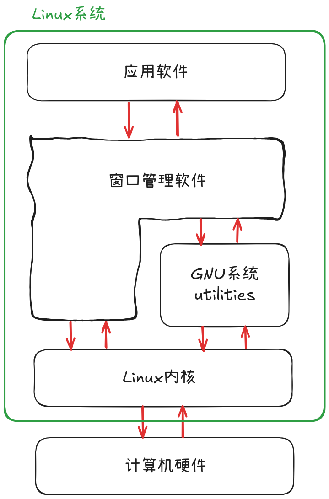
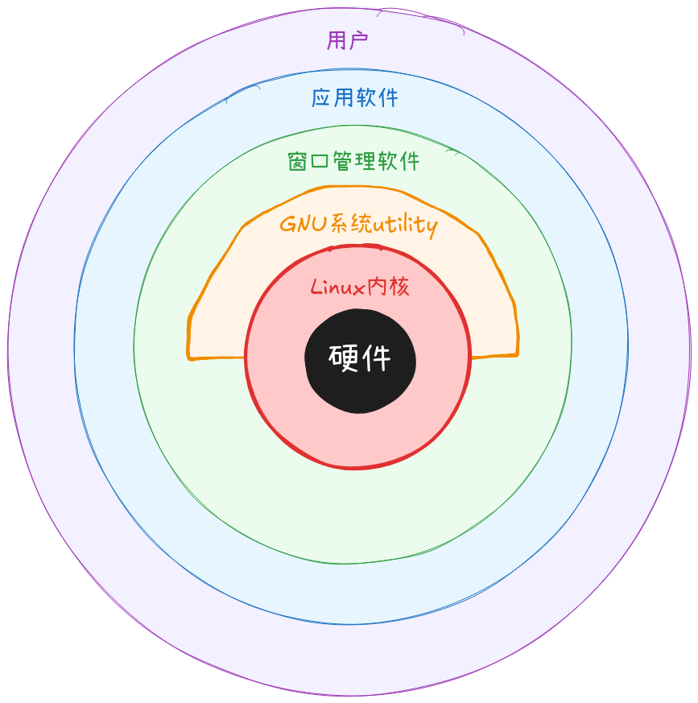

带着问题学习：
- 什么是Linux？
- 它从哪儿来？
- 它怎样运行？
- 为什么有这么多不同的Linux版本？
- 什么是distribution？
- 什么是LiveDVD？
- 什么是GNU？

> [!NOTE]
> **wade through**：花费大量时间和精力在无趣或困难的事上，尤指阅读了大量信息

对于初学者，可以认为Linux系统由4个部分组成
- Linux内核
- GNU utilities
- 图形桌面环境
- 应用软件

> [!NOTE]
> **utility**: 1, a service that is used by the public, such as an electricity or gas supply; 2, the usefulness of something, especially in a practical way. 1,公共服务，公共设施；2,（某物的）实际用处





内核是系统的核心，控制硬件和软件。在需要时分配硬件资源，在有需求时执行软件

> [!NOTE]
> **allocate**: to give something to someone as their share of a total amount, to use in a particular way. 分配：从有限数量的一堆东西里拿出一部分分给别人，并以特定方式使用

> [!NOTE]
> **kernel**: 坚果核，指能吃的那部分，与坚果壳shell相对。那桃核这种不能吃的核怎么说呢？答：pit或者core

Linus Torvalds，李纳斯·托瓦兹，Linux内核最初版本的发明者。他将代码开放给公众，允许任何人修改代码，但改动是否并入到内核由他审核。这种机制沿用至今，只不过审核人从Linus一个人变成了一个开发者团队。

[Linux内核源码官方下载地址](https://www.kernel.org/)

[Linux内核源码（不在首页展示的老版本）官方下载地址](https://www.kernel.org/pub/linux/kernel/)

内核主要有4种功能
- 管理系统内存
- 管理软件程序
- 管理硬件
- 管理文件系统

# 管理系统内存

**关键词**
- 虚拟内存 virtual memory
- 物理内存 physical memory
- 交换空间 swap space
- 换出 swap out
- 块 block
- 页 page
- 页表 page table

既管理物理内存，还要创建和管理虚拟内存，还要管理实际不存在的内存

硬盘上有一块特殊空间，叫做*交换空间*。内核交换虚拟内存位置里的内容，本质上是在交换空间和物理内存之间来回交换。这能让系统使用比物理内存更多的内存容量。我理解为“虚拟内存 = 物理内存 + 交换空间”

虚拟内存位置被分组（v. be grouped into）成块，把每块叫做一页。而内核把页要么定位到物理内存里，要么定位到交换空间里。因此，内核持有一个表，表中记录任一页是在物理内存里，还是被换出到硬盘里。

内核持续追踪哪些页正在被（程序）使用，并且自动把一段时间都没有被访问的页拷贝到交换空间里去，这叫做换出，这个操作并不是在物理内存用尽之后才进行，物理内存有空余时，也会存在换出。如果某程序想要访问之前被换出的页，内核必须负责在物理内存里开辟出一块空间把这页换进来，这就意味着要换出另一页，“腾地儿”。很显然，这种来回换入换出的操作耗费时间，会拖慢运行中的进程。但只要Linux系统还在运行，运行中的应用的换出过程就一直在持续。

可以使用以下4个命令查看交换空间大小和使用情况，这些命令展示的结果从上到下，从简到详
```bash
free -h
swapon --show
cat /proc/swaps
cat /proc/memNOTE
```

# 管理软件程序

**关键词**
- 进程 process
- init进程 init process
- SysVinit
- 运行级别 runlevel
- `/etc/inittab`
- `/etc/rc.d`
- Systemd
- unit文件
- 目标 target
- `systemctl`
- `ps`

Linux系统把正在运行的程序叫做进程。进程有在前台运行的，有能往显示屏显示内容的，也有在后台运行的。内核负责管理系统上的所有进程。内核创建第一个进程，这个进程叫做init进程，它能启动系统上的其他所有进程。当内核启动时，它把init进程加载到虚拟内存里。每当内核启动新的进程时，它会给进程在虚拟内存里分配一个独享空间，用来存这个进程自身使用的数据和代码

init进程是一个理论概念，有很多种实现（implementation），最常见的有两种
- `SysVinit`：SysVinit初始化方法，Linux最初使用的方法，基于Unix System V初始化方法。现已不被使用，但老发行版可能还在用。
- `Systemd`：systemd初始化方法，2010年出现，是现在使用最广泛的初始化和进程管理系统。

`SysVinit`初始化方法用到一个概念，叫做运行级别（runlevel），用来决定在启动init进程之后，启动哪些进程。

运行级别定义了运行中的Linux系统的状态，以及每种状态里该运行什么进程。

| 运行级别 | 描述 |
| --- | --- |
| 0 | 关闭系统 |
| 1 | 单用户模式，用于系统维护 |
| 2 | 多用户模式，但网络服务不可用 |
| 3 | 多用户模式，网络服务可用 |
| 4 | 自定义 |
| 5 | 多用户模式，带GUI |
| 6 | 重启系统 |

`/etc/inittab`文件定义了系统的默认运行级别，使用`cat /etc/inittab`查看，但现在的系统都用Systemd了，所以shell显示`No such file or directory`
进程以哪个特定运行级别运行，定义在`/etc/rc.d/`目录下的子目录里，在Systemd下一样无效，同上。
但可以使用`runlevel`命令来查看当前的运行级别，这个Systemd下也能用。

systemd初始化方法可以基于不同的活动启动进程
- 当系统启动时
- 当特定的硬件设备接入时
- 当服务启动时
- 当网络连接建立时
- 当计时器到点时

systemd方法通过将活动和unit文件链接到一起来决定哪些进程运行。每个unit文件里定义了，当某个活动发生时，要启动哪些程序。
`systemctl`程序能让你启动，终止，列出系统上正在运行的unit文件。

systemd方法还会把unit文件分组，叫做目标（targets）。一个目标定义了Linux系统的一个特殊的运行状态，类似SysVinit的运行级别。
在系统启动时，叫做`default.target`的unit文件定义了所有要启动的unit文件。
可以使用`systemctl`来查看当前默认目标`systemctl get-default`
输出结果`graphical.default`unit文件定义了多用户图形环境下运行的进程，类似SysVinit的运行级别5.

使用`ps`

> [!NOTE]
> expired: 1, If something that lasts for a fixed length of time expires, it comes to an end or stops being in use; 2, to die

> [!NOTE]
> indicate: to show, point or make clear in another way

> [!NOTE]
> determine: 1, to control or influence something directly, or to decide what will happen; 2, to make a strong decision; 3, to discover the facts or truth about something

# 管理硬件设备

**关键词**
- driver code
- kernel code
- driver module
- device file
- character device file
- block device file
- network device file
- nodes

任何Linux系统要连接的设备，都需要把设备对应的驱动代码插入到内核代码中去。
驱动代码能让数据在内核和设备之间来回传输，作为硬件和应用之间的中间层。
一般有2种方式把驱动代码插入到内核代码中
- 把驱动编译到内核里
- 把驱动模块添加到内核里

第一种方法，插入驱动代码的唯一方式是重新编译内核。也就是说添加一个新设备，就要重新编译一下内核。随着Linux内核支持越来越多的设备，这种方法变得低效。

于是有了第二种方法，向正在运行的内核插入驱动代码，程序员发明了内核模块的概念。用完设备，内核模块还可以从内核中被移除。这简化了并拓展了在Linux下使用硬件的场景。

Linux系统把硬件设备识别成特殊文件，叫做*设备文件*。分成3种
- 字符设备文件
- 块设备文件
- 网络设备文件

字符设备文件对应那些一个字符一个字符处理数据的设备。大部分调制解调器和终端都被创建成字符文件
块设备文件对应那些一次处理大量块的设备，比如硬盘
网络设备文件对应那些使用分组（packets）发送和接受数据的设备。包括网卡和特殊的环回（loopback）设备，这个设备用于系统使用常用网络编程协议与自身通信。

Linux为每个系统上的设备创建特殊文件，叫做nodes。所有与设备的通信都通过设备节点。每个节点都有一个唯一的数字对，让内核识别它们。数字对包括一个主设备号和副设备号。相似的设备主设备号一样，副设备号用来区分属于同一个主设备组的不同具体设备。

# 管理文件系统

不像其他OS,Linux内核支持不同类型的文件系统，用来从硬盘读写数据。
还可以读写其他OS——比如Windows——使用的文件系统。
内核必须和系统要使用的文件系统一同编译。

| 文件系统 | 描述 |
| --- | --- |
| ext4 | 第4代扩展文件系统，支持高级日志（journaling） |
| btrfs | 新一代，高性能文件系统，支持日志和大文件 |
| nfs | 网络文件系统 |
| ntfs | 支持微软NT文件系统 |
| ufs | BSD文件系统 |
| XFS | 高性能64位日志文件系统 |

这个表只从书上的表挑出使用最广泛的文件系统。

> [!NOTE]
> journaling: the act of writing what you have done each day, sometimes including your private thoughts, feelings, and goals

被Linux服务器访问的硬盘，必须事先被格式化成上面列出的文件系统的一种。

内核与每种文件系统之间的通信通过虚拟文件系统VFS.它为内核与各种类型的文件系统的通信提供了一种标准接口。VFS给每个被挂载上和正在使用的文件系统，在内存里缓存它们的信息。

> [!NOTE]
> interface(v.): to communicate with someone, especially in a work-related situation

3本比较有名，看的人最多的解析Linux内核（基于2.6.xx版本）的教材
- [**Understanding the Linux Kernel**](https://book.douban.com/subject/1776614/)
- [Professional Linux Kernel Architecture](https://book.douban.com/subject/3244090/)
- [Linux Kernel Development](https://book.douban.com/subject/3291901/)

